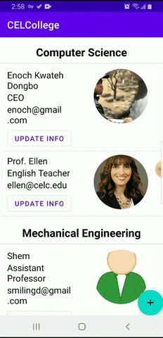
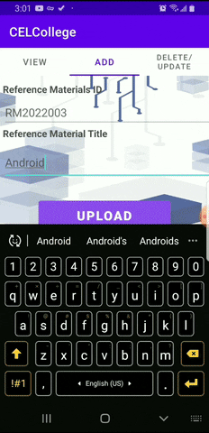
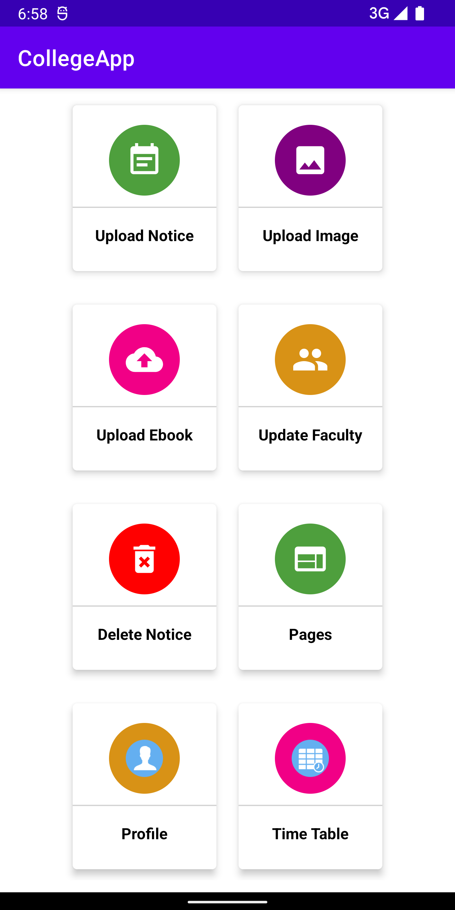
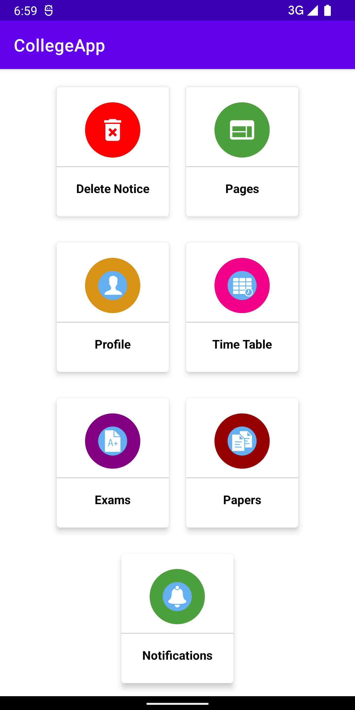
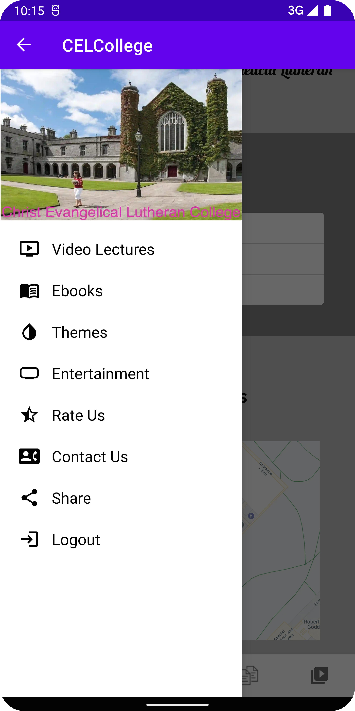
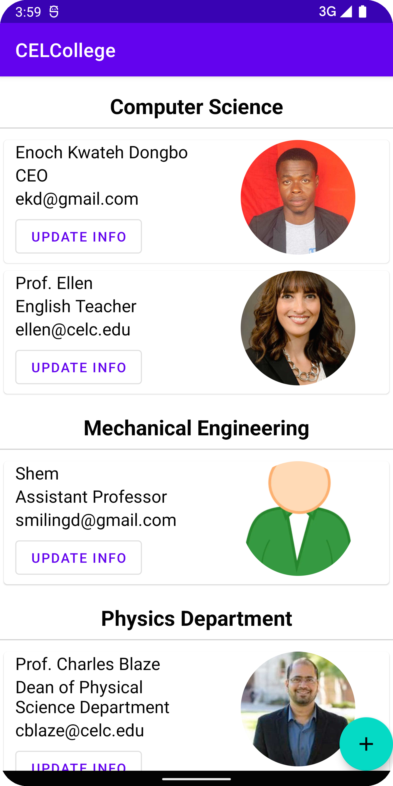
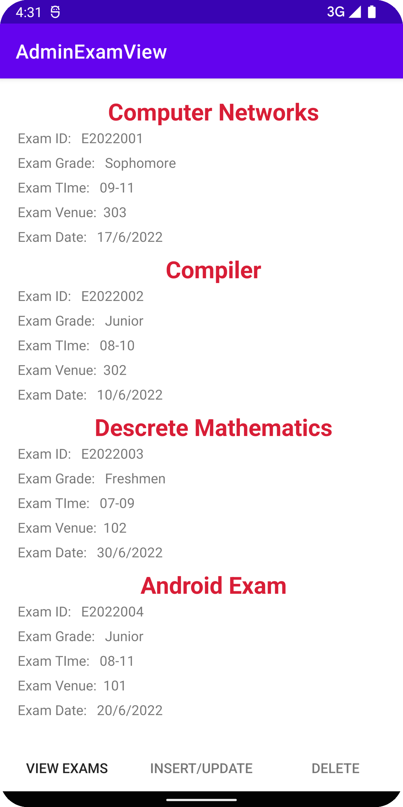
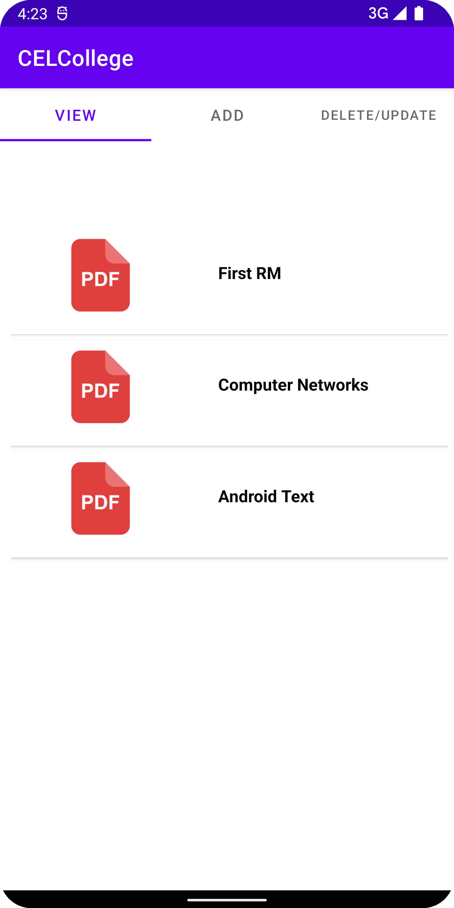
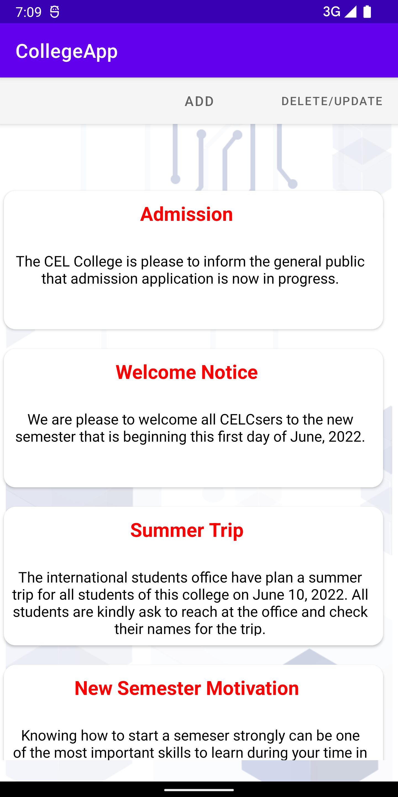

# CollegeApp
## About Project
This project is an android base application which was develop with [Android Studio](https://developer.android.com/studio/)

## Goal for project development
The main purpose is to develop a college app that will help administrators, faculties, teachers, and   students in various colleges and universities by enabling administrators to create an online environment   using any android device to conduct or manage college activities and other basic functionalities of a college remotely.   Some of these functionalities or activities include creating, reading, and updating faculty members as well as students, managing and publishing articles or news, exams, courses,   and timetables about the college, updating users, managing courses of the college, uploading, and sharing content, manipulating users, and lot more.

# App Demo 

  <b>Login</b>
  
  <b>Admin Panel</b>
     
  <b>Admin Panel</b>
  

## Screenshot

  
  
  
  
  
  
  
  

